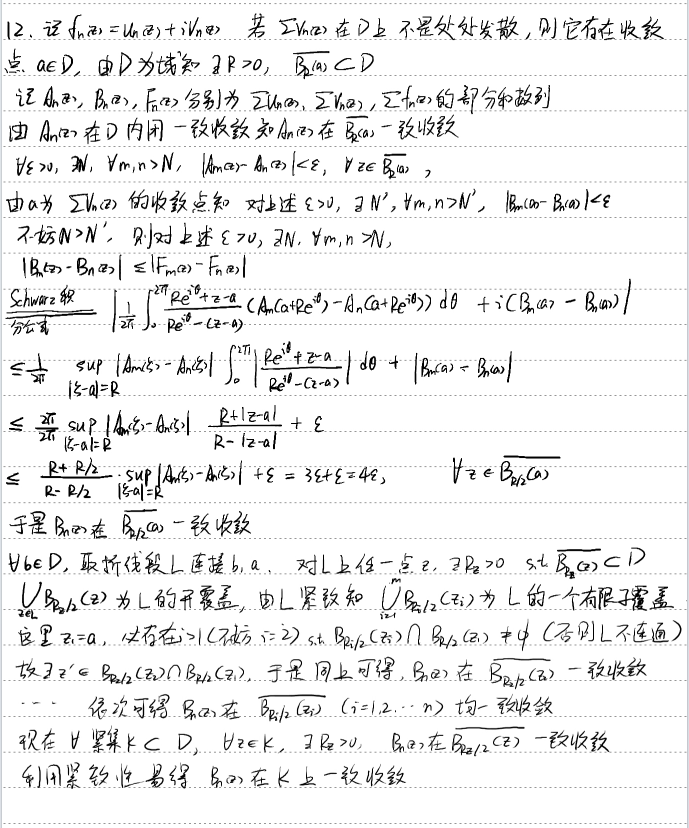

## 
CH3 Taylor Expansion of Analytic Functions

### 3.1 
####  $\boxed{Theorem} $  If $$f(z) = \sum_{n=0}^{\infty} c_n (z - a)^n \quad (z \in B(a, R))\tag{1}$$ and if $0 < r < R$, then $$\sum_{n=0}^{\infty} |c_n|^2 r^{2n} = \frac{1}{2\pi} \int_{-\pi}^{\pi} |f(a + re^{i\theta})|^2 \, d\theta.\tag{2}$$
**PROOF1:** We have
$$
f(a + re^{i\theta}) = \sum_{n=0}^{\infty} c_n r^n e^{in\theta}.\tag{3}
$$

For $r < R$, the series (3) converges uniformly on $[- \pi, \pi]$. Hence

$$
c_n r^n = \frac{1}{2\pi} \int_{-\pi}^{\pi} f(a + re^{i\theta}) e^{-in\theta} \, d\theta \quad (n = 0, 1, 2, \ldots),
$$

and (2) is seen to be a special case of Parseval's formula(real analysis edition).

---

**PROOF2:** Without loss of generality, let $a=0$.We have 
$$ \frac{1}{2\pi} \int_{0}^{2\pi} z^n \overline{z}^m \, d\theta = r^{n+m} \int_{0}^{2\pi} e^{i(n-m)\theta} \, d\theta = 
\begin{cases} 
0, & m \neq n, \\
r^{2n}, & m = n.
\end{cases} $$

Since $ f(z) = \sum\limits_{n=0}^{\infty} a_n (z-a)^n $ is absolutely and uniformly convergent on $ B(0,R)$, the order of summation and integration can be interchanged. Therefore,

$$\begin{align*}
\frac{1}{2\pi} \int_{0}^{2\pi} |f(re^{i\theta})|^2 \, d\theta &= \frac{1}{2\pi} \int_{0}^{2\pi} \left( \sum_{n=0}^{\infty} a_n z^n \right) \cdot \left( \sum_{m=0}^{\infty} \overline{a_m} \overline{z}^m \right) \, d\theta \\
&= \frac{1}{2\pi} \sum_{m,n=0}^{\infty} a_n \overline{a_m} \int_{0}^{2\pi} z^n \overline{z}^m \, d\theta = \sum_{n=0}^{\infty} |a_n|^2 r^{2n}.
\end{align*}$$

---

$ \boxed{Corollary} $ If $ f(z) = \sum\limits_{n=0}^{\infty} c_n z^n $ is a bounded holomorphic function on $ B(0,1) $, then $ \sum\limits_{n=0}^{\infty} |c_n|^2 < \infty $.

**PROOF:** Suppose 
$$ 
|f(z)|\le M,\forall z\in B(0,1).
$$

From above , we have
$$ 
\sum_{n=0}^{\infty} |c_n|^2 r^{2n} \le \frac{1}{2\pi}\int_{-\pi}^{\pi} M^{2} d\theta=M^{2}, \forall r\in (0,1).
$$

By the series version of **Levi's Theorem**, it follows that
$$ 
M^{2}\ge  \lim_{r \to 1^-} \sum_{n=0}^{\infty} |c_n|^2 r^{2n} = \sum_{n=0}^{\infty} |c_n|^2 .
$$

---

### 3.2
####  **AD判别法推广：** 若$\{a_n\}$和$\{b_n\}$满足条件
(1) $\displaystyle \{\sum_{k=1}^{n} a_k\}$有界;
(2) $\displaystyle \lim_{n\to\infty} b_n = 0$;
(3) $\displaystyle \sum_{n=1}^{\infty} |b_n - b_{n+1}| < \infty$,

则级数$\sum_{n=1}^{\infty} a_n b_n$收敛

 **HINT:Abel变换**
 
 
 
 ---

### 3.3 
#### (1) 复数项级数$\displaystyle \sum_{n=1}^\infty z_n$收敛，当且仅当$\displaystyle \sum_{n=1}^\infty \Re  z_n$和$\displaystyle \sum_{n=1}^\infty \Im z_n$同时收敛.
#### (2) 设$\displaystyle \sum_{n=1}^{\infty} f_n(z)$是非空点集$E$上的函数项级数. 则 $\displaystyle \sum_{n=1}^{\infty} f_n(z)$在$E$上一致收敛,当且仅当$\displaystyle \sum_{n=1}^{\infty} \text{Re} f_n(z)$和$\displaystyle \sum_{n=1}^{\infty} \text{Im} f_n(z)$都在$E$上一致收敛.

### 3.4
#### 设$\displaystyle \sum_{n=1}^{\infty} z_n$是复数项级数, 且$\displaystyle \varlimsup_{n \to \infty} \sqrt[n]{|z_n|} = q$. 证明:
#### (1) 若$q < 1$, 则$\displaystyle \sum_{n=1}^{\infty} z_n$绝对收敛;        (2) 若$q > 1$, 则$\displaystyle \sum_{n=1}^{\infty} z_n$发散.

### 3.5
####  <mark>Rabbe 判别法</mark>  设 $z_n \in \mathbb{C} \setminus \{0\}$, $\forall n \in \mathbb{N}$, 且 $\displaystyle \lim_{n \to \infty} \left| \frac{z_{n+1}}{z_n} \right| = 1$. 若 $\displaystyle \varlimsup_{n \to \infty} n \left( \left| \frac{z_{n+1}}{z_n} \right| - 1 \right) < -1$, 则 $\displaystyle \sum_{n=1}^{\infty} z_n$ 绝对收敛.

 **HINT:和实版本一样，凑出裂项来**
  **PROOF:**
 由条件可得 $\displaystyle \varliminf_{n \to \infty } n(\left| \frac{z_n}{z_{n+1}} \right|-1 ):=l>1$, 取 $\displaystyle \epsilon=\frac{l-1}{2},$
$$ 
\exists N>0,\forall n>N,n(\left| \frac{z_n}{z_{n+1}} \right|-1 )>l-\epsilon
$$

化简得
$$ 
\left| z_{n+1} \right| \frac{l-1}{2}<n\left| z_{n} \right|-(n+1)\left|z_{n+1}  \right|  , $$
  
求和得
$$ 
(S_{n+1}-S_{N})\frac{l-1}{2}<N\left| z_{N} \right|-(n+1)\left| z_{n+1} \right| <N\left| z_{N} \right|   
$$

注意 $N$ 固定，于是由单调有界定理即可 

  ---
 
### 3.6
#### 逐点敛散性判断
#### (1) $\displaystyle \sum\limits_{n=1}^{\infty}\frac{z^{n}}{z^{n}-1} $ 收敛域为 $B(0,1)$ 
 **PROOF:**

 - $\displaystyle z\in B(0,1),\left| \frac{z^{n}}{1-z^{n}} \right|\le \frac{\left| z^{n} \right| }{1-\left| z^{n} \right| }\le \frac{\left| z^{n} \right| }{1-\left| z \right| } $, 注意 $z$ 固定，原级数被收敛的几何级数控制，于是收敛
 - $\displaystyle \left| z \right|>1, $ 通项模长收敛于1,不收敛
 - $\displaystyle \left| z \right| =1,z=e^{\mathrm{i}\alpha \pi},0\le \alpha<2$  
   - $\displaystyle  \alpha =\frac{p}{q}\in \mathbb{Q},z^{2q}=1,$ 级数无意义
   - $\displaystyle \alpha \notin \mathbb{Q},\frac{z^{n}}{1-z^{n}}=\frac{1}{1-z^{n}}-1=\frac{\mathrm{i}}{2}\frac{e^{\mathrm{i}n\alpha\pi/ 2}}{\sin n\alpha \pi /2}=\frac{\mathrm{i}}{2}\cot n\alpha\pi /2-\frac{1}{2}$ 极限不为零，不收敛

 ---
#### (2) $\displaystyle \sum\limits_{n=1}^{\infty}\frac{e^{\mathrm{i}nz}}{n} , \Im z>0.$ （收敛）  
 **PROOF:**
$\displaystyle z=x+\mathrm{i}y,\left| z_n \right| \left| \frac{e^{\mathrm{i}nz}}{n} \right| =\left| \frac{e^{-ny+inx}}{n} \right|=\frac{e^{-ny}}{n},\sqrt[n]{z_n} \to e^{-y}\le 1$

再由[3.4](ch3.md#34)即可
 
 
 ---

#### (3) $\displaystyle \sum_{n=1}^{\infty} \frac{\alpha(\alpha + 1) \dots (\alpha + n - 1) \beta(\beta + 1) \dots (\beta + n - 1)}{n! \gamma(\gamma + 1) \dots (\gamma + n - 1)}$, Re($\alpha + \beta - \gamma$) < 0, $\gamma \neq 0, -1, -2, \dots$ （收敛）
利用题[3.5](ch3.md#35), 易得 $\displaystyle \lim_{n \to \infty}\left| \frac{z_{n+1}}{z_{n}} \right|=1, $ 只需 $\displaystyle \varliminf_{n \to \infty}n(\left| \frac{z_n}{z_{n+1}} \right|-1)>1 $ 

由 
$$\begin{align*}
\sqrt{1+2\alpha_1 \frac{1}{n}+\frac{\left| \alpha \right|^{2} }{n^{2}}}&=1+\frac{\alpha_1}{n+o(\frac{1}{n})}\\
\sqrt{1+2\alpha_1 \frac{1}{n}+\frac{\left| \alpha \right|^{2} }{n^{2}}}\sqrt{1+2\beta_1 \frac{1}{n}+\frac{\left| \beta \right|^{2} }{n^{2}}} &=1+\frac{\alpha_1+\beta_1}{n}+o(\frac{1}{n})           
\end{align*}$$

可得
$$\begin{align*}
n(\left| \frac{z_n}{z_{n+1}} \right|-1 )=n \left[ \left| \frac{(1+n)(\gamma +n)}{(\alpha+n)(\beta+n)} \right| -1 \right] &= n \frac{(n+1)\sqrt{(\gamma_1+n)^{2}+\gamma_2^{2}}-\sqrt{(\alpha_1+n)^{2}+\alpha_2^{2}}\sqrt{(\beta_1+n)^{2}+\beta_2^{2}}}{\sqrt{(\alpha_1+n)^{2}+\alpha_2^{2}}\sqrt{(\beta_1+n)^{2}+\beta_2^{2}}}\\
&\sim n\left[  (1+\frac{1}{n})\sqrt{1+2\gamma_1 \frac{1}{n}+\frac{\left| \gamma \right|^{2} }{n^{2}}}-\sqrt{1+2\alpha_1 \frac{1}{n}+\frac{\left| \alpha \right|^{2} }{n^{2}}}\sqrt{1+2\beta_1 \frac{1}{n}+\frac{\left| \beta \right|^{2} }{n^{2}}} \right]             \\
&\sim n\left[ (1+\frac{1+\gamma_1}{n}) -(1+\frac{\alpha_1+\beta_1}{n})+o(\frac{1}{n})\right] \to 1+\Re (\gamma-\alpha-\beta) >1
\end{align*}$$

---
#### (4)

---

### 3.7 
#### 设 $\displaystyle \sum_{n=1}^{\infty} f_n(z)$ 是域 $D$ 上的全纯函数项级数. 证明: 若 $\displaystyle \sum_{n=1}^{\infty} \text{Re} f_n(z)$ 在 $D$ 上内闭一致收敛, 则 $\displaystyle \sum_{n=1}^{\infty} \text{Im} f_n(z)$ 或者在 $D$ 上内闭一致收敛, 或者在 $D$ 上处处发散.
 **HINT:圆链法**
  **PROOF:**
  
  
  
---
 
 
 
### 3.8
####  若 $\{\lambda_n\}$ 是严格单调增加, 并且以 $\infty$ 为极限的正数列, 则称 $\sum_{n=1}^{\infty} a_n e^{-\lambda_n z}$ 为 Dirichlet 级数. 证明:

#### (1) 若该级数在 $z_0 = x_0 + iy_0$ 处收敛, 则它在半平面 $\{z \in \mathbb{C}: \text{Re} z > x_0\}$ 上内闭一致收敛;
 **PROOF:**
对于任意紧致集 $K \subseteq \left\{ z\in \mathbb{C}|\Re  z>x_0 \right\} ,$ 可设 $\Re z\ge x_0+\delta,\left| z-z_0 \right|<R,\forall z\in K $    
 
$$ \sum\limits_{n=1}^{\infty}a_ne^{-\lambda_nz}=\sum\limits_{n=1}^{\infty}a_ne^{-\lambda_nz_0}e^{-\lambda_n(z-z_0)} ,\\
A_m:=\sum\limits_{n=1}^{m}a_ne^{-\lambda_nz_0},b_n(z):=e^{-\lambda_n(z-z_0)}
$$

由条件可得 $A_m$ 有界，设 $|A_m|\le M$. 并且还有 $0\le |b_n(z)|\le e^{-\lambda_n R},\forall z\in K$, 于是有
$$\begin{align*}
\left| b_n(z)-b_{n+1}(z) \right|=\int_{\lambda_n}^{\lambda_{n+1}}-(z-z_0)e^{-t(z-z_0)}  dt &\le R \int_{\lambda _{n}}^{\lambda _{n+1}}\left| e^{-t(z-z_0)} \right|   dt   \\
&\le R  \int_{\lambda _{n}}^{\lambda _{n+1}}e^{-tR}  dt =e^{-\lambda_n R}-e^{-\lambda _{n+1} R}                   
\end{align*}$$

由 **Abel Transform** 可得
$$\begin{align*}
\left|  \sum\limits_{k=n}^{m}a_ke^{-\lambda_kz_0}e^{-\lambda_k(z-z_0)} \right| &=\left| A_m b_{m}(z)+\sum\limits_{k=n}^{m-1}(b_k(z)-b_{k+1}(z))A_k-b_n(z)A_{n-1} \right|\\             
&\le Me^{-\lambda_m R}+M\sum\limits_{k=n}^{m-1}\left| b_k(z)-b_{k+1}(z) \right| +Me^{-\lambda _{n}R}\\
&\le Me^{-\lambda_m R}+M\sum\limits_{k=n}^{m-1}\left( e^{-\lambda_k R}-e^{-\lambda _{k+1}R} \right) +Me^{-\lambda _{n}R}=2Me^{-\lambda_nR}\\
\end{align*}$$

于是容易得出一致收敛性

 ---

#### (2) 若该级数在 $z_0 = x_0 + iy_0$ 处绝对收敛, 则它在闭半平面 $\{z \in \mathbb{C}: \text{Re} z \geq x_0\}$ 上绝对一致收敛.
 **PROOF:**   直接用M判别法很容易 
 
 ---

### 3.9
#### 设正数列$\{a_n\}$ 单调收敛于零. 证明:  $\displaystyle \sum_{n=1}^{\infty} a_n z^n$ 的收敛半径 $R \geq 1$ 且 $\displaystyle \sum_{n=1}^{\infty} a_n z^n$ 在 $\partial B(0, 1) \backslash \{1\}$ 上处处收敛.
 **PROOF:**
 $a_n$ 有界，设 $|a_n|\le M$ , 则有 
 $$ R=\frac{1}{\varlimsup\limits_{n \to \infty}\sqrt[n]{a_n}}\ge \frac{1}{\lim\limits_{n \to \infty}\sqrt[n]{M}}=1  $$

后半句话可以归结到 $\sum\limits_{n=1}^{\infty}a_n \cos n\theta,\sum\limits_{n=1}^{\infty}a_n \sin n\theta$ 在 $\theta\in (0,2\pi)$ 时收敛   
 
 ---

#### 3.10
#### 证明: $\displaystyle \sum_{n=1}^{\infty} \frac{(-1)^{\lfloor \sqrt{n} \rfloor}}{n} z^n$ 在其收敛圆周 $\partial B(0, 1)$ 上处处收敛, 但不绝对收敛.

 **PROOF:**
不绝对收敛性显然. 收敛性：
 - $z=1:$  见zs讲义p563 左右
 - $\displaystyle  z=e^{\mathrm{i}\theta},\theta\in (0,2\pi),\left| \sum\limits_{i=1}^{n}z^{i} \right|\le \frac{1}{\left| 1-z \right| } $ 有界, 注意这里 $z$ 固定
  $$\begin{align*}
  \sum\limits_{n=1}^{\infty}\left|\frac{ (-1)^{\left[ \sqrt[]{n} \right] }  }{n}-\frac{ (-1)^{\left[ \sqrt[]{n+1} \right] }  }{n+1}\right|&=\sum\limits_{n=1}^{\infty}\sum\limits_{k=n^{2}}^{(n+1)^{2}-1}\left| \frac{ (-1)^{\left[ \sqrt[]{k} \right] }  }{k}-\frac{ (-1)^{\left[ \sqrt[]{k+1} \right] }  }{k+1} \right|              \\
  &=\sum\limits_{n=1}^{\infty}\left[ \sum\limits_{k=n^{2}}^{(n+1)^{2}-2}(\frac{1}{k}-\frac{1}{k+1})+\frac{1}{(n+1)^{2}-1} +\frac{1}{(n+1)^{2}}\right](-1)^{n} \\
  &=\sum\limits_{n=1}^{\infty}(-1)^{n}\left[ \frac{1}{n^{2}}+\frac{1}{(n+1)^{2}} \right] <\infty
  \end{align*}$$  
  
  且 $\displaystyle \frac{(-1)^{\left[ \sqrt[]{n} \right] }}{n}\to 0,n \to +\infty$, 由题[3.2](ch3.md#32)即可
 
 ---

### 3.11
#### 设幂级数 $\displaystyle f(z) = \sum_{n=0}^{\infty} a_n z^n$ 的收敛半径为 1, $\displaystyle z_0 \in \partial B(0, 1)$. 证明: 若 $\displaystyle \lim_{n \to \infty} n a_n = 0$, 并且 $\displaystyle \lim_{r \to 1} f(r z_0)$ 存在, 则 $\displaystyle \sum_{n=0}^{\infty} a_n z_0^n$ 收敛于 $\displaystyle \lim_{r \to 1} f(r z_0)$.

 **HINT:定义+Cauchy准则即可**

 
 
 ---

### 3.12 设 $D$  是域, $a\in D$, 函数 $f$ 在 $D\backslash\{a\}$  上全纯.证明:$\lim\limits_{z \to a}  (z-a)f(z) = 0$, 则 $f$ 在 $D$  上全纯.
 **PROOF:**
************************
&&******* 
 
 
 ---

### 3.13
#### (1) $|e^z - 1| \le e^{|z|} - 1 \le |z|e^{|z|}$, $\forall z \in \mathbb{C}$.
#### (2) $(3 - e) |z| < |e^z - 1| < (e - 1) |z|$, $0 < |z| < 1$.

---

### 3.14
#### $\displaystyle  f(z) = \sum_{n=0}^\infty a_n z^n$ 的收敛半径 $R > 0$, $0 < r < R$, $\displaystyle A(r) = \max_{|z|=r} \text{Re } f(z)$. 证明:
#### (1) $\displaystyle  a_n r^n = \frac{1}{\pi} \int_0^{2\pi} \Re  f(re^{i\theta}) e^{-in\theta} d\theta$, $\forall n \in \mathbb{N}$. 
 **HINT:用 $\displaystyle  a_{k}=\frac{f^{k}(0)}{k!}$  计算即可**

 ---

#### (2) $|a_n| r^n \le 2A(r) - 2 \text{Re } f(0)$, $\forall n \in \mathbb{N}$.
 **HINT:由（1）, 且 $\Re f(0)$ 暗示考虑 $a_{n}0^{n}$**
 
 
 
 ---

### 3.15
#### 设 $\displaystyle  f(z) = 1 + \sum_{n=1}^\infty a_n z^n$ 在 $B(0, 1)$ 上全纯, 并且 $\text{Re } f(z) \ge 0$, $\forall z \in B(0, 1)$. 证明:
#### (1) $|a_n| \le 2$, $\forall n \in \mathbb{N}$. 
 **PROOF:**
$$\begin{align*}
\left| a_nr^{n} \right|\le \int_{0}^{2\pi} \Re  f(e^{\mathrm{i}\theta}) d\theta = \frac{1}{\pi}2\pi\Re  f(0)=2  
\end{align*}$$

 ---

#### (2) $\displaystyle \frac{1 - |z|}{1 + |z|} \leq \mathrm{Re}\, f(z) \leq |f(z)| \leq \frac{1 + |z|}{1 - |z|},\ \forall z \in B(0, 1);$
 **NOTE:右边那个可以直接通过幂级数计算得到，但这无法解决左边的** 
 **PROOF1:**
对于 $0 < r < 1$，由上题 
$$\begin{align*}
a_n = \frac{1}{\pi r^n} \int_0^{2\pi} \left[ f(re^{i\theta}) \right] e^{-in\theta} d\theta, \quad \forall n \geq 1  
\end{align*}$$

从而
$$\begin{align*}
f(z) = 1 + \sum_{n=1}^\infty a_n z^n &= 1 + \sum_{n=1}^\infty \frac{z^n}{\pi r^n} \int_0^{2\pi} f(re^{i\theta}) e^{-in\theta} d\theta\\
&= \frac{1}{2\pi} \int_0^{2\pi} f(re^{i\theta}) d\theta + \int_0^{2\pi} \frac{r e^{i\theta}}{r e^{i\theta} - z} \mathrm{Re} f(re^{i\theta}) d\theta\\
&= \frac{1}{2\pi} \int_0^{2\pi} \frac{r e^{i\theta} + z}{r e^{i\theta} - z} \mathrm{Re} f(re^{i\theta}) d\theta \tag{*}  
\end{align*}$$

**【注意：这里（*）也可以由题[2.8](ch2.md#28 )】**    
 进而
$$
|f(z)| \leq \frac{1}{2\pi} \int_0^{2\pi} |r + z e^{-i\theta}| \cdot |r - z e^{-i\theta}|^{-1} \mathrm{Re} f(re^{i\theta}) d\theta \leq \frac{r + |z|}{r - |z|} \mathrm{Re} f(0)
$$

令 $r \to 1^-$，即得 
$$\begin{align*}
|f(z)| \leq \frac{1 + |z|}{1 - |z|}  
\end{align*}$$

又对(*)两端取实部得
$$\begin{align*}
\mathrm{Re} f(z) = \frac{1}{2\pi} \int_0^{2\pi} \mathrm{Re} \frac{r e^{i\theta} + z}{r e^{i\theta} - z} \mathrm{Re} f(re^{i\theta}) d\theta &= \frac{1}{2\pi} \int_0^{2\pi} \frac{r^2 - |z|^2}{|r e^{i\theta} - z|^2} \mathrm{Re} f(re^{i\theta}) d\theta\\
&\geq \frac{1}{2\pi} \int_0^{2\pi} \frac{r^2 - |z|^2}{(r + |z|)^2} \mathrm{Re} f(re^{i\theta}) d\theta = \frac{r - |z|}{r + |z|} \mathrm{Re} f(0)  
\end{align*}$$

令 $r \to 1^-$，即得 
$$\begin{align*}
|f(z)| \geq \mathrm{Re} f(z) \geq \frac{1 - |z|}{1 + |z|}.  
\end{align*}$$

 ---
**PROOF2:**
对 $\displaystyle g(z)=\frac{f(z)-1}{f(z)+1}$ 用 **Schwarz引理** 得(*)式 $\displaystyle \left| \frac{f(z)-1}{f(z)+1}\right|\le |z| $, i.e. $\displaystyle |f(z)|\le  \frac{1+|z|}{1-|z|}  $  

对(*)式两端取实部得
$$ 
(u-1)^{2}+v^{2}\le |z|^{2}((u+1)^{2}+v^{2})\implies \left| \frac{u-1}{u+1} \right|^{2}\le |z|^{2} 
$$

$$ 
\ldots
$$

---

#### (3) $\displaystyle |a_1^2 - a_2| \leq 2,\quad |2a_1 a_2 - a_1^3 - a_3| \leq 2.$
 **HINT:只要熟悉[幂级数除法](分析基础知识.md#12)的前几项即可**
 
 
 
 ---

### 3.16
#### 设 $D$ 是有界域，$f \in H(D) \cap C(\overline{D})$。证明：若 $f$ 在 $\partial D$ 上不取零值，则 $f$ 在 $D$ 中只有有限个零点。
 **法1： Cantor闭集套定理+零点孤立性**
  **法2：** 若 $f$ 在 $D$ 内有无限多个零点，取其中可数个设为 $z_k \in D$。由 $D$ 有界及致密性定理知
$$\begin{align*}
\exists\, k_j,\, z_0 \in \overline{D},\ \text{s.t.}\ \lim_{j \to \infty} z_{k_j} = z_0 \implies f(z_0) = \lim_{j \to \infty} f(z_{k_j}) = 0.  
\end{align*}$$

由 $f|_{\partial D} \neq 0$ 知 $z_0 \notin \partial D \implies z_0 \in D$。从而由全纯函数的唯一性定理知 $f|_D \equiv 0$。由 $f \in C(\overline{D})$ 知 $f|_{\partial D} = 0$。这与 $f|_{\partial D} \neq 0$ 矛盾。故有结论。

 ---

#### 3.17
#### 设 $D$ 是域，$a \in D, f \in H(D)$，并且 $\displaystyle\sum_{n=0}^{\infty} f^{(n)}(a)$ 收敛。证明：
#### (1) $f$ 可延拓为 $\mathbb{C} $ 上全纯函数 ；
 **PROOF:**
考虑幂级数 $\displaystyle  F(z) = \sum_{k=0}^{\infty} a_k \frac{(z-a)^k}{k!}$，由 $  \displaystyle \lim_{n \to \infty}S_n$ 存在知 $\displaystyle \lim_{k \to \infty} a_k = 0$。特别地，
 
$$\begin{align*}
\exists\, M > 0,\, \text{s.t.}\ \forall k \geq 1,\, |a_k| \leq M \implies \sqrt[k]{|a_k|} \leq \sqrt[k]{M} \implies \frac{\sqrt[k]{M}}{k^{1/k}} \to 1,\ k \to \infty  
\end{align*}$$

故 $F(z)$ 的收敛半径为 $+\infty$，即 $F$ 是整函数。由 $f\in H(D)$ 知 
$$ 
f|_{D} = F|_{D}  
$$ 

又由全纯函数的唯一性知
$$\begin{align*}
F|_\mathbb{C} = F|_{D} = f|_{D}   
\end{align*}$$

这就是说 $D$ 上的全纯函数 $f$ 可延拓为 $\mathbb{C}$ 上的全纯函数（就是整函数）$F$。

 ---

#### (2) $\displaystyle\sum_{n=0}^{\infty} f^{(n)}(z)$ 在 $\mathbb{C}$ 上内闭一致收敛。
 **PROOF:**
$$
F^{(n)}(z) = \sum_{k=n}^{\infty} a_k \frac{(z-a)^k}{k!} = \sum_{i=0}^{\infty} a_{n+i} \frac{(z-a)^i}{i!}
$$

对 $\mathbb{C}$ 中任一紧集 $K$，有
$$\begin{align*}
\sup_{z \in K} \left| \sum_{k=n+1}^{n+p} F^{(k)}(z) \right| = \sup_{z \in K} \left| \sum_{k=n+1}^{n+p} \sum_{i=0}^{\infty} a_{k+i} \frac{(z-a)^i}{i!} \right|
&= \sup_{z \in K} \left| \sum_{i=0}^{\infty} \frac{(z-a)^i}{i!} \sum_{k=n+1}^{n+p} a_{k+i} \right|\\
&= \sup_{z \in K} \left| \sum_{i=0}^{\infty} \frac{(z-a)^i}{i!} (S_{n+p+i} - S_{n+i}) \right|\\
&\leq \sup_{k \geq n} |S_{k+p} - S_{k}| \cdot \sup_{z \in K} \sum_{i=0}^{\infty} \frac{|z-a|^i}{i!}\\
&= \sup_{k \geq n} |S_{k+p} - S_{k}| \cdot \sup_{z \in K} e^{|z-a|} \xrightarrow{n \to \infty} 0  
\end{align*}$$

故 $\displaystyle \sum_{n=0}^{\infty} F^{(n)}(z)$ 在 $\mathbb{C}$ 上内闭一致收敛。
 
 
 ---

### 3.18
#### $\boxed{定理：实解析函数展开为幂级数的充要条件}$  对于 $x_0 \in \mathbb{R}, R > 0$，设 $f(x) \in C^{\infty}(x_0 - R, x_0 + R)$。证明：$f(x)$ 可在 $(x_0 - R, x_0 + R)$ 展开为 $x_0$ 处的幂级数的充要条件是存在一个 $[0, R)$ 上的非负值函数 $M(r)$，使得$$\displaystyle\left| f^{(n)}(x) \right| \leq \frac{M(r)\, n!}{(r - |x - x_0|)^{n+1}}, \quad \forall n \geq 0,\, x \in (x_0 - r, x_0 + r)$$
**PROOF:**

不妨设 $x_0 = 0$，否则平移即可。

**必要性**：当 $f(x)$ 在 $(x_0 - R, x_0 + R)$ 展开为 $x_0$ 处的幂级数，解析延拓到 $|z| < R$，因此对给定的 $|x| < r$，由 Cauchy 积分公式，有
$$
\displaystyle
f^{(n)}(x) = \frac{n!}{2\pi i} \int_{|\zeta| = r} \frac{f(\zeta)}{(\zeta - x)^{n+1}} d\zeta
$$

从而
$$
\displaystyle
|f^{(n)}(x)| \leq \frac{n!}{2\pi} \int_{|\zeta| = r} \frac{|f(\zeta)|}{|\zeta - x|^{n+1}} ds \leq \sup_{|z| = r} |f(z)| \cdot \frac{n!}{(r - |x|)^{n+1}}
$$

我们完成了必要性证明。

**充分性**：我们证明 $f(x)$ 在 $(-R, R)$ 处实解析即可。事实上，对给定 $|x| < r$，取 $r > \delta > 0$，使得 $|x| < \delta$，当 $y \in (-\delta, \delta) \cap (x - r + \delta, x + r - \delta)$，

$$
\displaystyle
R_n(x)=\frac{f^{(n)}(\theta(y))}{n!} |y - x|^n \leq \frac{M(r)\, |y - x|^n}{(r - |\theta(y)|)^{n+1}} \leq \frac{M(r)\, |y - x|^n}{(r - \delta)^{n+1}} \to 0,n \to +\infty
$$
 **NOTE:也可以用积分余项计算**
因此我们完成了证明。

---

### 3.19 分别用 Rouche Theorem，幅角原理，最大模原理 证明代数学基本定理：任一 $n$ 次方程$$a_0 z^n + a_1 z^{n-1} + \cdots + a_{n-1} z + a_n = 0 \quad (a_0 \neq 0)$$有且只有 $n$ 个根（几重根就算作几个根）。
 **PROOF1:**
 令 $f(z) = a_0 z^n$, $\varphi(z) =a_0 z^{n}+ a_1 z^{n-1} + \cdots + a_n$，当 $z$ 在充分大的圆周 $C: |z| = R$ 上时，取
$$
R > \max \left\{ \frac{|a_1| + \cdots + |a_n|}{|a_0|},\, 1 \right\},
$$

有
$$\begin{align*}
|f(z)-\varphi(z)| \leq |a_1| R^{n-1} + \cdots + |a_{n-1}| R + |a_n|&\le R^{n-1} \left( \sum\limits_{i=1}^{n}|a_i| \right)   \le \left| f(z) \right| 
\end{align*}$$

由 Rouche Theorem 知 $f(z)$ 和 $\varphi(z)$ 在 $B(0,R)$ 上有相同个数的根, 共 $n$ 个。

而在圆周 $|z| = R$ 上，或者在它的外部，任取一点 $z_0$，则 $|z_0|: = R_0 \geq R$，于是
$$\begin{align*}
|a_0 z_0^n + a_1 z_0^{n-1} + \cdots + a_n| 
&\geq |a_0 z_0^n| - |a_1 z_0^{n-1} + \cdots + a_n| \\
&\geq |a_0| R_0^n - (|a_1| R_0^{n-1} + \cdots + |a_n|)\\
&\geq |a_0| R_0^n - (|a_1| + |a_2| + \cdots + |a_n|) R_0^{n-1}\\
&=(a_0R-\sum\limits_{i=1}^{n}|a_i|)R^{n-1}>0 \\
\end{align*}$$

于是原 $n$ 次方程在圆周 $|z| = R$ 上及其外部没有根。所以原 $n$ 次方程在 $z$ 平面上有且只有 $n$ 个根。

---

 **PROOF2:**
取 $\displaystyle R > \max \left\{ \frac{|a_1| + \cdots + |a_n|}{|a_0|},\, 1 \right\},$ 同上可得原 $n$ 次方程在圆周 $|z| = R$ 上及其外部没有根。而在 $B(0,R)$ 内，
$$ 
\left| \frac{  a_1 z^{n-1} + \cdots + a_n}{a_0 z^n} \right| <1
$$

记 $\gamma$ 为 $B(0,R)$ 正向边界，计算有
$$\begin{align*}
\Delta \text{Arg}_{\gamma}\varphi(z) =\Delta  \text{Arg}_{\gamma}a_0z^{n} \left( 1+\frac{  a_1 z^{n-1} + \cdots + a_n}{a_0 z^n} \right)=\text{Arg}_{\gamma}a_0z^{n}+0=n\cdot 2\pi
\end{align*}$$

于是由幅角原理知 $\varphi(z)$ 在 $B(0,R)$ 内有 $n$ 个根。又因为在圆周 $|z| = R$ 上，$\varphi(z)$ 没有根，所以原 $n$ 次方程在 $z$ 平面上有且只有 $n$ 个根。

 
 
 ---

**PROOF3:**
**只要证任意 $n$  次多项式 $p(z)$  在复平面必有零点**
 
若不然, 
$$
\forall z\in \mathbb{C},\forall R>|z|,|\frac{1}{p(z)}|\le \max_{|z|=R}|\frac{1}{p(z)}|,
$$  

由于 $\displaystyle \lim_{z \to \infty}|p(z)|=+\infty$ , 令 $R \to +\infty$, 则 $\displaystyle |\frac{1}{p(z)}|\le 0$, 这不可能！

---

### 3.20
#### 设 $D$ 是由有限条可求长简单闭曲线围成的域。证明：若 $f, g \in H(\overline{D})$，$f$ 在 $\partial D$ 上没有零点，$f$ 在 $D$ 中的全部彼此不同的零点为 $z_1, z_2, \cdots, z_n$，其相应的阶数分别为 $k_1, k_2, \cdots, k_n$，则$$\frac{1}{2\pi i} \int_{\partial D} g(z) \frac{f'(z)}{f(z)} dz = \sum_{j=1}^n k_j g(z_j).$$
**（说明：这是 Cauchy 积分公式和幅角原理的推广。）**

 **HINT:和幅角原理证明类似**
**PROOF:**
只要证，对充分小的 $\epsilon >0$ 有
$$ 
\frac{1}{2\pi i} \int\limits_{|z-z_i|=\epsilon} g(z) \frac{f'(z)}{f(z)} dz =  k_i g(z_i)
$$ 

在 $B(z_i,\epsilon) $ 内有
$$ 
f(z) = (z-z_i)^{k_i} h(z),\quad \ h(z_i) \neq 0
$$
 
于是易得
$$ 
\frac{f'(z)}{f(z)}=\frac{k_i}{z-z_i}+\frac{h'(z)}{h(z)} 
$$

再由 **Cauchy Integral Formula** 知  
$$ 
\frac{1}{2\pi i} \int\limits_{|z-z_i|=\epsilon} g(z) \frac{f'(z)}{f(z)} dz = k_i g(z_i) + 0
$$

 ---

### 3.21
#### **Eneström-Kakeya 定理(1897)**
#### $0<a_0<a_1<\ldots<a_n$, 则多项式 $P(z) = a_0 + a_1 z + \cdots + a_n z^n$ 的全部零点都在 $|z| < 1$ 内, 且无实根。
 **PROOF:**

设 $P(z) = 0$ 且 $|z| \geq 1$，则 $(1 - z)P(z) = 0$，即
$$
a_n z^{n+1} = a_0 + (a_1 - a_0)z + \cdots + (a_n - a_{n-1})z^n,
$$

于是有 (1) 式：
$$
a_n |z|^{n+1} = |a_0 + (a_1 - a_0)z + \cdots + (a_n - a_{n-1})z^n| \leq a_0 + |a_1 - a_0||z| + \cdots + |a_n - a_{n-1}||z|^n.
$$

则
$$
a_n |z| \leq \frac{a_0}{|z|^n} + \frac{|a_1 - a_0|}{|z|^{n-1}} + \cdots + |a_n - a_{n-1}| \leq a_0 + |a_1 - a_0| + \cdots + |a_n - a_{n-1}| = a_n.
$$

从而 $|z| \leq 1$，故 $|z| = 1$ 时 (1) 式取等号当且仅当
$$
\arg a_0 = \arg (a_1 - a_0)z = \cdots = \arg (a_n - a_{n-1})z^n.
$$

即 $\arg z = 0$，故 $z = 1$，然而 $P(1) > 0$，因此 $P(z)$ 的全部根在 $|z| < 1$ 内。

---

 **COROLLARY:** 
#### 设多项式 $$P(z) = a_n z^n + a_{n-1} z^{n-1} + \cdots + a_1 z + a_0$$ 满足所有系数 $a_k > 0$，则 $P(z)$ 的所有复根 $z$ 满足 $\displaystyle r_{\text{min}} \leq |z| \leq r_{\text{max}}, $ 其中 $ \displaystyle  r_{\text{min}} = \min_{1 \leq k \leq n}   \frac{a_{k-1}}{a_k},  r_{\text{max}} = \max_{1 \leq k \leq n} \frac{a_{k-1}}{a_k}.$
 **PROOF:** 定义辅助多项式 $Q(x) = P(rx) = a_0 + a_1 r x + \cdots + a_n r^n x^n $，为了应用定理条件，令 
$$
0<a_1r<a_2r<\ldots<a_nr,\text{i.e.,}r>\max_{1\le k\le n}\frac{a_{k-1}}{a_k}
$$ 

设 $Q(x)$ 的零点为 $x_0$, 则 $|x_0|<1$, $P(x)$ 的根 $|rx_0|<r$, 由 $r$ 的任意性，令 $r\to r_{\text{max}}^{+}$，则 $|rx_0|\leq r_{\text{max}}$。 

另一方面，易得 $P(x)$ 零点不可能为零。考虑 $P(x)$ 的互反多项式 $\displaystyle P^{*}(x)=x^{n}P(\frac{1}{x})$, 对 $P^{*}(x)$ 使用上面的操作可得不等式另一个方向. 

---

### 3.22
#### 设 $0 < a_0 < a_1 < \cdots < a_n$。证明：三角多项式$$a_0 + a_1 \cos \theta + a_2 \cos 2\theta + \cdots + a_n \cos n\theta$$在 $(0, 2\pi)$ 中有 $2n$ 个不同的根且没有虚根。  
 **PROOF1:**
考虑 $P(z) = a_n z^n + a_{n-1} z^{n-1} + \cdots + a_1 z + a_0$. 令 $z$ 在 $|z| = 1$ 上正向绕行一周，由幅角原理和上面定理，$P(z)$ 绕原点 $n$ 周（根的个数），且与虚轴至少相交 $2n$ 次。由于每一个交点对应一个辐角，故至少有 $2n$ 个**不等**的 $\theta$ 使 $P(z) = P(e^{i\theta})$ 在虚轴上，使
$$
\mathrm{Re}\left[ P(e^{i\theta}) \right] = a_0 + a_1 \cos \theta + \cdots + a_n \cos n\theta = 0.
$$

令 $\displaystyle z = e^{i\theta}$, $\displaystyle \cos k\theta = \frac{z^k + z^{-k}}{2}$，就有
$$
\sum_{k=0}^n a_k \cos k\theta = \frac{z^{-k}}{2} \left( a_n + a_{n-1}z + \cdots + 2a_0 z^n + a_1 z^{n+1} + \cdots + a_n z^{2n} \right).
$$

因为等式右边至多有 $2n$ 个根 $z_j$（$1 \leq j \leq 2n$），所以在 $(0, 2\pi)$ 内也有 $2n$ 个不等实根，这给出了左边在区间 $0 < \theta < 2\pi$ 上有且仅有 $2n$ 个互异的根，且没有虚根。
 
 
---
**PROOF2:**  
下面用实分析的方法证明（构造其实也源自于上一个定理的证明）。设 $\displaystyle f(\theta) = \sum_{i=0}^n a_i \cos i\theta$，定义
$$\begin{align*}
g(\theta) = 2\sin\frac{\theta}{2} f(\theta) &= 2a_0 \sin\frac{\theta}{2} + \sum_{i=1}^n a_i \left[ \sin\left(i+\frac{1}{2}\right)\theta - \sin\left(i-\frac{1}{2}\right)\theta \right]\\
&= a_0 \sin\frac{\theta}{2} + \sum_{i=0}^{n-1} (a_i - a_{i+1}) \sin\left(i+\frac{1}{2}\right)\theta + a_n \sin\left(n+\frac{1}{2}\right)\theta.  
\end{align*}$$

由
$$
\left| \sin\left(n+\frac{1}{2}\right)\theta \right| = 1 \iff \left(n+\frac{1}{2}\right)\theta = k\pi + \frac{\pi}{2},\ k \in \mathbb{Z} \iff \theta = \frac{2k+1}{2n+1}\pi
$$

知当 $\displaystyle \theta = \theta_k = \frac{2k+1}{2n+1}\pi,\ k=0,1,\ldots,2n$ 时，
$$\begin{align*}
g(\theta_k)\cdot(-1)^k &= \left[ a_0 \sin\frac{\theta}{2} + \sum_{i=0}^{n-1} (a_i - a_{i+1}) \sin\left(i+\frac{1}{2}\right)\theta \right](-1)^k + a_n\\
&> -a_0 + \sum_{i=0}^{n-1} (a_i - a_{i+1}) + a_n = 0.  
\end{align*}$$

这表明 $g(\theta_k)g(\theta_{k+1}) < 0,\ k=0,\ldots,2n-1$。由连续函数介值定理即知 $g$（从而 $f$）在 $(\theta_k, \theta_{k+1})$ 上各有一根。最终我们确实证明了结论。

---

### 3.23
#### 设 $D$ 是域，$f_n : D \to \mathbb{C} \setminus \{0\}$ 是全纯映射，$\forall n \in \mathbb{N}$。证明：若 $\{f_n\}$ 在 $D$ 上内闭一致收敛于 $f$，则或者 $f(D) = \{0\}$，或者 $f(D) \subset \mathbb{C} \setminus \{0\}$。
**HINT:** 由Hurwitz定理这是显然

---

**EG:** 利用上题的结论证明：若域 $D$ 上的单叶全纯函数数列 $\{f_n\}$ 在 $D$ 上内闭一致收敛于 $f$，则或者 $f$ 是常数，或者 $f$ 是 $D$ 上的单叶全纯函数。
**HINT:** $\forall z\in D, g_n(z):=f_n(z)-f_n(z_1) \rightrightarrows f(z)-f(z_1) $, 再由上题

---
