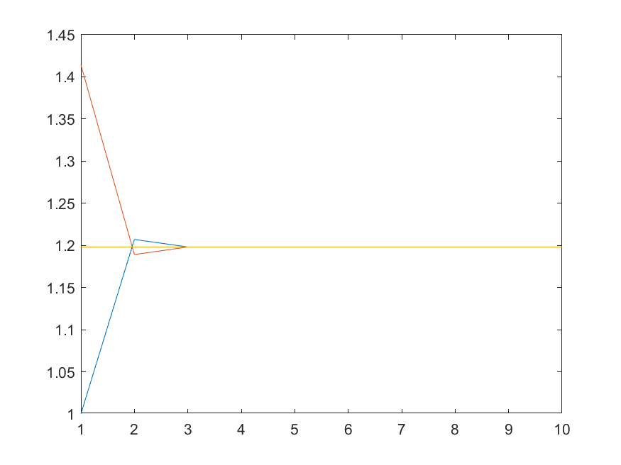

<link rel="stylesheet" type="text/css" href="http://zlyd.iccnconn.com/markdowncss/stylelib/typora-purple-theme-1.5.7/purple.css">

# 第一次作业


## 1.4.2


<!-- 
 -->


**code:**
```matlab
x0 = 100;
y0 = 10;
x1 = 110;  
beta = 5;
n = 10;   
k = 1:n;

alpha = 0.1;
x_k = x0 + (-alpha*beta).^(k-1) * (x1 - x0);
y_k = y0 - alpha*(x_k- x0);

figure;
subplot(2,1,1);  
plot(k, x_k, 'b-o', 'LineWidth', 1.5, 'MarkerSize', 6);
grid on;
ylim([95,110]);  
title('α=0.1, β=5','FontSize', 16);
text(3, 104, 'x_k', 'FontSize', 16);

subplot(2,1,2);  
plot(k, y_k, 'r-o', 'LineWidth', 1.5, 'MarkerSize', 6);
grid on;
ylim([9.0,10.5]);  
text(3.5, 10.1, 'y_k', 'FontSize', 16);
title('α=0.1, β=5','FontSize', 16); 
set(gcf, 'Position', [100, 100, 800, 600]);
saveas(gcf, '1.4.2.1.png');


alpha = 0.24;
x_k = x0 + (-alpha*beta).^(k-1) * (x1 - x0);
y_k = y0 - alpha*(x_k- x0);

figure;
subplot(2,1,1);  
plot(k, x_k, 'b-o', 'LineWidth', 1.5, 'MarkerSize', 6);
grid on;
ylim([50,150]);  
title('α=0.24, β=5','FontSize', 16);
text(3, 104, 'x_k', 'FontSize', 16);

subplot(2,1,2);  
plot(k, y_k, 'r-o', 'LineWidth', 1.5, 'MarkerSize', 6);
grid on;
ylim([0,25]);  
text(3.5, 10.1, 'y_k', 'FontSize', 16);
title('α=0.24, β=5','FontSize', 16); 
set(gcf, 'Position', [100, 100, 800, 600]);
saveas(gcf, '1.4.2.2.png');
```


## 1.4.3
画了 $a_n,b_n$和题干中常数的函数图像，三者在一起作比较。结果是收敛的。
<!-- 
 -->


```matlab
syms t;
q = 2/pi * int(1/sqrt(1-t^4), t, 0, 1)
qq = 1/double(q)
n = 10;
a = zeros(1,n);
b = zeros(1,n);
q = qq + zeros(1,n)
a(1) = 1;
b(1) = sqrt(2);
for i = 1:n-1
    a(i+1) = (a(i)+b(i))/2;
    b(i+1) = sqrt(a(i)*b(i));
end
plot(1:n,a)
hold on
plot(1:n,b)
hold on
plot(1:n,q)
saveas(gcf, '1.4.3.png');
```


## 1.4.5
**证明：**
记针的中点到最近平行线的距离为 x，$\displaystyle  0 ≤ x ≤ \frac{d}{2}$ 
记针与平行线的夹角为 θ，$0 ≤ θ ≤ π。$ 
针与平行线相交的条件是：$ \displaystyle x ≤ \frac{d}{4}\sin(θ)$ 
相交概率 $\displaystyle  p=\frac{\int_{0}^{\pi} \frac{d}{4}\sin \theta \ d\theta}{\pi\cdot \frac{d}{2}}=\frac{1}{\pi}\approx \frac{m}{n}  $ 
**实验：**


**code:**
```matlab
d = 1;      
L = d/2;   
n = 100000;  
m = 0;      % 相交次数
for i = 1:n
    %  随机生成针的中点到最近平行线的距离 x 服从 [0, d/2] 上的均匀分布
    x = d/2 * rand();
    % theta 服从 [0, pi] 上的均匀分布
    theta = pi * rand();
    if x <= (L/2) * sin(theta)
        m = m + 1;
    end
end
pi_approx =  n / m;
fprintf('投掷次数: %d\n', n);
fprintf('相交次数: %d\n', m);
fprintf('π 的近似值: %.6f\n', pi_approx);
fprintf('真实 π 值: %.6f\n', pi);
```


## 1.4.14
**证明:**
$$ \begin{align*}
    I_0=1-e^{-1},I_n&=e^{-1}\int_{0}^{1} x^{n} de^{x} \\
  &=e^{-1}[x^{n}e^x {\Big |}_{0}^{1} -\int_{0}^{1} nx^{n-1}e^{x} dx] =1-nI_{n-1}
\end{align*} $$

**实验：**
正向递推时，我们以积分值显然大于零为依据，依次令 $n=80,100,1000, $ 都显示在 $n=18$ 时出错。反向递推时没有这样的错误。
原因：用浮点数计算e的时候一定是有误差的，正向递推表达式里不断乘 $n$，是在将误差不断放大导致出现这种反常现象。反向递推时表达式里不断除 $n$，误差在不断减小。
**这启示数值计算时选取合适的算法保证数值稳定性的重要性。** 

**code:**
```matlab
I0 = 1 - exp(-1); % 初始值
n_max = 80; % 最大计算次数
I = zeros(1, n_max + 1); % 初始化数组
I(1) = I0;

% 正向递推计算
for n = 1:n_max
    I(n+1) = 1 - n * I(n); % 计算下一个值
    if I(n+1) < 0 
        fprintf('正向递推在 n = %d 时出现错误\n', n); % 输出错误信息
        break;
    end
end


% 反向递推
n_start = n_max; 
I_reverse = zeros(1, n_max + 1); % 初始化数组
I_reverse(n_start + 1) = (exp(-1) + 1) / (n_start + 1) *0.5;  % 计算最后一个值

for i = n_start:-1:1
    I_reverse(i) = (1 - I_reverse(i+1)) / (i+1);
end

plot(1:n_max+1, I, 'b', 'DisplayName', '正向递推')
hold on 
plot(1:n_max+1,I_reverse, 'r', 'DisplayName', '反向递推')
legend show;
saveas(gcf, '1.4.14.png');
```