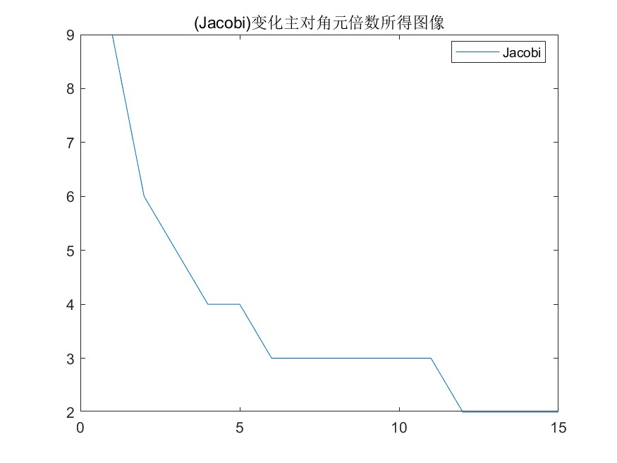

<link rel="stylesheet" type="text/css" href="http://zlyd.iccnconn.com/markdowncss/stylelib/typora-purple-theme-1.5.7/purple.css">

# 第五次作业


## 5.5.3
### （1） 我们控制误差 $tol=10^{-5}$  ,分别固定b，改变x0；固定x0，改变b，得到的迭代次数都不大，说明都是收敛的。并做出 n_J 和 n_GS 的散点图，方便比较分析。**均得出结论：GS法收敛速度快于Jacobi法**
### 代码部分是先写了函数文件，分别根据输入的向量x0和b，返回迭代次数。再在主文件中用for循环作出散点图。(为了方便直接应用到第二问，这里还增加了参数 $3^t$ ，控制矩阵A主对角元的倍数。第一问仅需保持 $t=0$ )


**主文件 code:**
```matlab
n = 20;
x = ones(n,1) * linspace(0,5,11);
b = ones(n,1) * (1:11);

n_Jlist = zeros(size(x,2),2);
n_GSlist = zeros(size(x,2),2);

for k = 1:size(x,2)
    x0 = x(:,k);
    b0 = b(:,1);
    [n_Jlist(k,1), n_GSlist(k,1)] = func5(x0,b0,0)
end

figure;
plot(1:size(x,2), n_Jlist(:,1)', 1:size(x,2), n_GSlist(:,1)')
legend("Jacobi", "Goss-Sider", "Location", "best")
title('变化x0所得图像')
saveas(gcf,'5_5_3_1.jpg')

for k = 1:size(b,2)
    x0 = x(:,1);
    b0 = b(:,k);
    [n_Jlist(k,2), n_GSlist(k,2)] = func5(x0,b0,0)
end

figure;
plot(1:size(b,2), n_Jlist(:,2)', 1:size(b,2), n_GSlist(:,2)')
legend("Jacobi", "Goss-Sider", "Location", "best")
title('变化b所得图像')
saveas(gcf,'5_5_3_2.jpg')

```

**函数文件 code:**
```matlab
function [n_J,n_GS] = func5(x0,b,t)
    n=20;
    A1=sparse(1:n,1:n,3,n,n);
    A2=sparse(1:n-1,2:n,-1/2,n,n);
    A3=sparse(1:n-2,3:n,-1/4,n,n);
    A=3^t*A1 + A2 + A2' + A3 + A3';
    D=diag(diag(A));
    U=-triu(A,1);
    L=-tril(A,-1);
    
    tol=1e-5;


    %Jacobi 
    B_J=D\(L+U);
    f_J=D\b;
    x_J = x0 * (1:100);
    n_J=0;
    %Gauss-Seidel
    B_GS = (D-L)\U;
    f_GS = (D-L)\b;
    x_GS = x0 * (1:100);
    n_GS=0;
    
    for i=1:100
        x_J(:,i+1) = B_J * x_J(:,i) + f_J;
        n_J = n_J+1;
        if (norm(x_J(:,i+1) - x_J(:,i),inf) < tol) 
            break; 
        end
    end

    for i=1:100
        x_GS(:,i+1) = B_GS * x_GS(:,i) + f_GS;
        n_GS = n_GS+1;
        if (norm(x_GS(:,i+1) - x_GS(:,i),inf) < tol) 
            break; 
        end
    end
    
end
```

### （2）利用第一问的函数文件，第二问是很容易的。**注意：$ |x^{(k+1)}-x^{(k)}|_{\infty}\le 10^{-5} $，这已蕴含在函数文件中。结论：随着主对角占优的程度增加，收敛速度变得很快**   
**还注意到极限情况：两次（$x^{(3)}-x^{(2)}$ ）即达到收敛要求，这是因为 $|x^{(3)}-x^{(2)}|_{\infty}\le |B|_{\infty} |x^{(2)}-x^{(1)}|$, 当k足够大时，$|B|_{\infty} $ 非常小，于是迭代两次即达到收敛要求**


**code:**
```matlab
n = 20;
m=15;
x = ones(n,1) * linspace(0,5,11);
b = ones(n,1) * (1:11);

n_Jlist = zeros(m,1);
n_GSlist = zeros(m,1);

for k = 1:m
    x0 = x(:,1);
    b0 = b(:,1);
    [n_Jlist(k,1), n_GSlist(k,1)] = func5(x0,b0,k);
end

figure;
plot(1:m, n_Jlist(:,1)')
legend("Jacobi", "Location", "best")
title('(Jacobi)变化主对角元倍数所得图像')
saveas(gcf,'5_5_3_3.jpg')

```

## 5.5.4
### b=0.2 ,三者图像基本重合，只有计算时间差异，图像对比如下


### 若考虑b的误差，$b \in [0.18,0.22]$  我们取步长 0.005。 **计算每个b值下的cond（A），发现前四个比较大，非常病态，后四个在二三十左右，病态没那么严重。**

**code:**
```matlab
c=10;
a1=0.5;
a2=0.25;
b=0.2;
p=-a1*b*c;
q=-a2*b*(1-a1)*b*c;

% 稀疏矩阵法
x0 = 50; xn = 600; n = 49;
A1 = sparse(1:n, 1:n, p, n, n); % 输入A的对角元素
A2 = sparse(1:n-1, 2:n, 1, n, n); % 输入A的(上)次对角元素
A3 = sparse(2:n, 1:n-1, q, n, n); % 输入A的(下)次对角元素
A = A1 + A2 + A3;
i = [1,n], j = [1,1];
s = [-q * x0, -xn];
bb = sparse(i, j, s, n, 1); 
x = A \ bb; 
k = 0:n+1; 
xxxs = [x0, x', xn]; 
% 满矩阵
AA=full(A);
x = AA \ bb; 
xxman = [x0, x', xn];

% 追赶法
f=zeros(n, 1); f(1)=-q*x0;f(n) = -xn;
u(1)=p;
y(1)=f(1);
for i=2:n
    l(i)=q/u(i-1);
    u(i) = p-l(i);
    y(i) = f(i) -l(i) *y(i-1);
end
xzg= zeros(1,n);
xzg(n) = y(n)/u(n);
for i=n-1:-1:1
    xzg(i) = (y(i)-xzg(i+1))/u(i);
end

figure(1)
plot(k, xxxs, 'r', 'LineWidth', 1); hold on;
plot(k, xxman, '--g', 'LineWidth', 1.5);
plot(1:n, xzg, '.k', 'LineWidth', 1)
grid on;
legend('稀疏矩阵求解', '满矩阵求解','追赶法求解' ,'Location', 'best');
saveas(gcf, '5_5_4_1.png')


figure(2) 
hold on;  
grid on;
for r = 0:8
    b = 0.18 + (0.005 * r);
    p=-a1*b*c; 
    q=-a2*b*(1-a1)*b*c;
    A1 = sparse(1:n, 1:n, p, n, n); % 输入A的对角元素
    A2 = sparse(1:n-1, 2:n, 1, n, n); % 输入A的(上)次对角元素
    A3 = sparse(2:n, 1:n-1, q, n, n); % 输入A的(下)次对角元素
    A = A1 + A2 + A3;
    condest(A)
    i = [1,n];
    j = [1,1];
    s = [-q * x0, -xn];
    bb = sparse(i, j, s, n, 1); 
    x = A \ bb;
    xxxs = [x0, x', xn]; 
    plot(k, xxxs)
    legends{r+1} = sprintf('b=%.3f', b);  

end
legend(legends, 'Location', 'best');  
saveas(gcf, '5_5_4_2.png')
```

## 5.5.9   
### （1）
$$ 
 \begin{bmatrix} 
    \tilde{x}_1 \\
    \tilde{x}_2 \\
    \vdots \\
    \tilde{x}_n  \end{bmatrix} 
=\begin{bmatrix}
    b_1 & b_2 & \cdots & b_n \\
    s_1 & 0 & \cdots & 0 \\
    0 & s_2 & \cdots & 0 \\
    \vdots & \vdots & \ddots & \vdots \\
    0 & 0 & \cdots & s_{n-1}\end{bmatrix}
 \begin{bmatrix}
    x_1 \\
    x_2 \\
    \vdots \\
    x_n\end{bmatrix}
-\begin{bmatrix}
    0 \\ 
    h_1 \\ 
    \vdots \\ 
    h_{n-1}\end{bmatrix}
=\begin{bmatrix}
    x_1 \\ 
    x_2 \\ 
    \vdots \\ 
    x_n\end{bmatrix}
$$
即
$$ (A-I_n)X=H $$
这里 
\[
A=\begin{bmatrix}
    b_1 & b_2 & \cdots & b_n \\
    s_1 & 0 & \cdots & 0 \\
    0 & s_2 & \cdots & 0 \\
    \vdots & \vdots & \ddots & \vdots \\
    0 & 0 & \cdots & s_{n-1}\end{bmatrix},\quad   
X=\begin{bmatrix}
    x_1 \\
    x_2 \\
    \vdots \\
    x_n\end{bmatrix} ,\quad
H=\begin{bmatrix}
    0 \\ 
    h_1 \\ 
    \vdots \\ 
    h_{n-1}\end{bmatrix}
\]
### （2）$x_{i}$ 依次如下

**code:**
```matlab
A1 = sparse(1, [3, 4], [5, 3], 5, 5);
A2 = sparse(2:5, 1:4, [0.4, 0.6, 0.6, 0.4], 5, 5);
A = A1 + A2;
M = A - eye(5);
h = [0 500 400 200 100]';
x = M \ h;
x'

```
### （3）$h_i$无法均为500，这是种群数量出现负值
 


