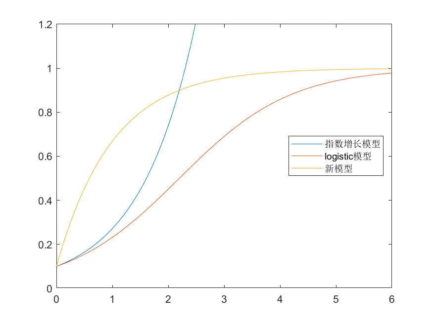

<link rel="stylesheet" type="text/css" href="http://zlyd.iccnconn.com/markdowncss/stylelib/typora-purple-theme-1.5.7/purple.css">

# 第二次作业


## 2.4.4
由(25)式,$$ \begin{align*}
\displaystyle x(t)=\frac{x_m}{1+ce^{-rt}},c=\frac{x_m}{x_{0}}-1  \end{align*} $$
则 $$ \begin{align*}
x''(t)=\left( \frac{2 c^2 e^{-2rt} r^2}{(1 + c e^{-rt})^3} - \frac{c e^{-rt} r^2}{(1 + c e^{-rt})^2} \right) x_m  \end{align*} $$ 
令 $x''=0,$ $$ \begin{align*}
e^{rt_0}=c=\frac{x_m}{x_0}-1  \end{align*} $$
回代有 $$ \begin{align*}x(t)=\frac{x_m}{1+e^{-r(t-t_0)}}\end{align*} $$

## 2.4.5
**推导:**
$$ \begin{align*}
x(t+\Delta t)-x(t)&=k(x_m-x(t))\Delta t \\
x'(t)&=k(x_m-x(t))   \\
x(t)&=x_m-(x_m-x_0)e^{-kt} \end{align*} $$
**code:**
```matlab
x0 = 0.1;
xm = 1;
r = 1;
t = linspace(0, 6, 100)
x1 = @(t) x0 * exp(r * t);
x2 = @(t) xm ./ (1 + (xm / x0 - 1) * exp(-r * t));
x3 = @(t) xm - (xm -x0) * exp(-r * t);
plot(t, x1(t), t, x2(t), t, x3(t))
legend('指数增长模型', 'logistic模型', '新模型', 'Location', 'best')
ylim([0, 1.2])
saveas(gcf, '2.4.5.1.png');
```
**图像:**


 