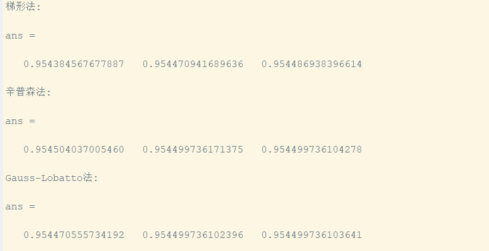

<link rel="stylesheet" type="text/css" href="http://zlyd.iccnconn.com/markdowncss/stylelib/typora-purple-theme-1.5.7/purple.css">

# 第三次作业


## 3.4.1(4)
$m$  取值100编写了 $n$  的函数，每个n值做一幅图。并用for循环观察 $n$ 从10到70的变化(图片结果只列三个) $:n\in [10,60]$ 时，图像误差随 $n$ 增大逐渐变小；而 $n\ge 60$ 时就会出现龙格现象。数据误差的列举中我们只考虑最大值。 
<!-- 

 -->


**code:**
```matlab

for i = 10:60
    ff(i)
    pause;
end

function y = ff(n)
    x0 = linspace(-2, 2, n);
    x = linspace(-2, 2, 100);
    y0 = exp(-x0.^2);
    y1 = lagr(x0, y0, x);
    y2 = interp1(x0, y0, x);
    y3 = interp1(x0, y0, x, 'spline');
    y4 = exp(-x.^2);
    [max(y1 - y4), max(y2 - y4), max(y3 - y4)]
    plot(x, y1, x, y2, x, y3, x, y4, 'k--');
    legend('拉格朗日插值', '分段线性插值', '三次样条插值', '原函数', 'Location', 'best');
end

```


## 3.4.4（4）
梯形法中步长用n来改变。后两方法分别限制误差在 $10^{-4},10^{-8},10^{-10}$ 内


**code:**
```matlab
f = @(x) (1 / sqrt(2 * pi)) * exp(-x.^2 / 2);
y1 = @(n) trapz(linspace(a, b, n+1), f(linspace(a, b, n+1)));
y2 = @(tol) quad(f, a, b, tol);
y3 = @(tol) quadl(f, a, b, tol);
a = -2;
b = 2;
disp('梯形法:');
format long
[y1(50) y1(100) y1(150)]
disp('辛普森法:');
format long
[y2(1.0e-4) y2(1.0e-8) y2(1.0e-10)]
disp('Gauss-Lobatto法:');
format long
[y3(1.0e-4) y3(1.0e-8) y3(1.0e-10)]

```

