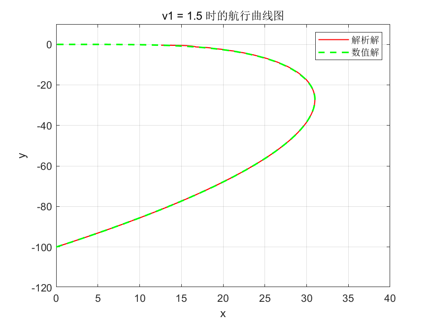
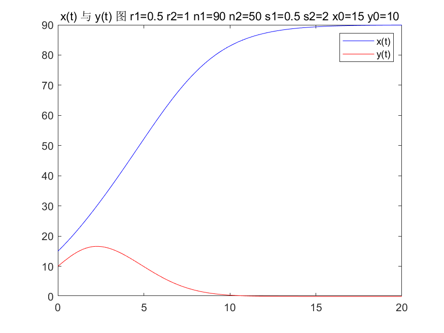
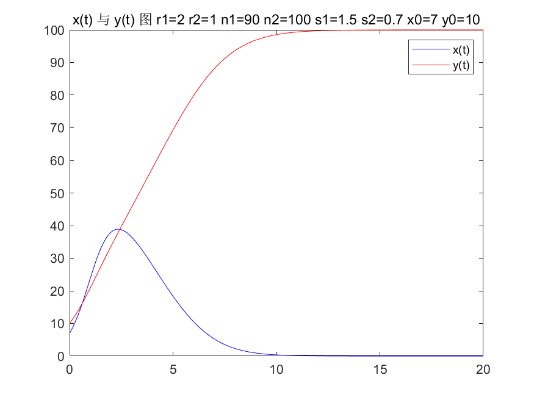

<link rel="stylesheet" type="text/css" href="http://zlyd.iccnconn.com/markdowncss/stylelib/typora-purple-theme-1.5.7/purple.css">

# 第四次作业


## 4.6.6
 (1)建立如图所示坐标系，小船记为点C，$\angle ABC:=\theta$ 


 则有 
$$
\begin{cases} 
\displaystyle \frac{dx}{dt} = v_1 - v_2 \frac{x}{\sqrt{x^2+y^2}}, \\ 
\displaystyle \frac{dy}{dt} = -v_2 \frac{y}{\sqrt{x^2+y^2}} \\
x_0=0,y_0=-d
\end{cases}
$$
 记 $k=\frac{v_1}{v_2},$ 两式相除
$$ \frac{dx}{dy}=\frac{k\sqrt{x^2+y^2}-x}{-y} $$
 令 $\frac{x}{y}=t, \frac{dx}{dy}=t+y\frac{dy}{dt}$  ,化简得
$$ \frac{dt}{\sqrt{1+t^2}}=\frac{kdy}{y} $$
 积分然后代入初值条件
$$ x+\sqrt{x^2+y^2}=d^{-k}(-y)^{1+k} $$

 (2) t=67s时抵达：

 航行曲线对比:

**code:**
```matlab
function plotship(v1)
    ts = 0:0.5:70;
    d = 100;
    x0 = [0, -100];
    v2 = 2;
    k = v1 / v2;
    [t, x] = ode45(@(t, x) func(t, x, v1, v2), ts, x0);
    figure(1);
    plot(t, x(:,1), 'b-', t, x(:,2), 'r--', 'LineWidth', 1.5), grid on;
    title(['v1 = ', num2str(v1), ' 时的 x(t) 与 y(t)图']);
    legend('x(t)', 'y(t)');
    saveas(gcf, ['4_6_6_1_v1_', num2str(v1), '.png']);
    
    figure(2);
    fimplicit(@(x, y) sqrt(x.^2 + y.^2) - x - d^(-k) .* (-y).^(1 + k), ...
        [0, 20, -120, 10], 'r', 'LineWidth', 1);
    hold on;
    plot(x(:,1), x(:,2), '--g', 'LineWidth', 1.5);
    grid on;
    xlabel('x');
    ylabel('y');
    title(['v1 = ', num2str(v1), ' 时的航行曲线图']);
    legend('解析解', '数值解');
    saveas(gcf, ['4_6_6_2_v1_', num2str(v1), '.png']);
    
    close all;
end


function dxdt = func(~, x, v1, v2)
    r = sqrt(x(1)^2 + x(2)^2);
    dxdt = [v1 - v2 * x(1) / r; -v2 * x(2) / r];
end
```


 v1=0 的情形退化为直线，t=50
 v1=0.5 的情形, t=53s : 


 v1=1.5 的情形, t=114s : 

 v1=2 的情形, 无法抵达 :


## 4.6.9
 (1) 最终 x(t) 趋于稳定值，y(t) 趋于0，即近乎灭亡


**code:**
```matlab
function zq(r1, r2, n1, n2, s1, s2, x0, y0)
    z0 = [x0, y0];
    ts = linspace(0, 10, 100);
    [t,z] = ode45(@(t,z) f(t, z, r1, r2, n1, n2, s1, s2), ts, z0);
    figure(1);
    plot(ts, z(:,1), 'b', ts, z(:,2), 'r' )
    title(['x(t) 与 y(t) 图 r1=', num2str(r1), ' r2=', num2str(r2), ' n1=', num2str(n1), ' n2=', num2str(n2), ' s1=', num2str(s1), ' s2=', num2str(s2)]);
    legend('x(t)', 'y(t)');
    saveas(gcf,['4_6_9_1_',num2str(r1), num2str(r2), num2str(n1), num2str(n2), num2str(s1),  num2str(s2), '.png'])

    figure(2)
    plot(z(:,1), z(:,2))
    title(['相图 r1=', num2str(r1), ' r2=', num2str(r2), ' n1=', num2str(n1), ' n2=', num2str(n2), ' s1=', num2str(s1), ' s2=', num2str(s2)]);
    saveas(gcf,['4_6_9_2_',num2str(r1), num2str(r2), num2str(n1), num2str(n2), num2str(s1),  num2str(s2), '.png'])
end

function dz = f(t, z, r1, r2, n1, n2, s1, s2)
dz = [r1 * z(1) * (1 - z(1)/n1 - s1 * z(2)/n2); r2 * z(2) * (1 - z(2)/n2 - s2 * z(1)/n1)];
end
```
 (2) 前半问：只调整s以外的参数，图像前期趋势略有变化，但最终稳定情况与第一小问相同



 后半问：上面三个图对应结果如下



 由图像可知，反倒是 x(t) 趋于0，y(t) 趋于一个正的稳定值。于是可以得出结论：S1,S2是影响种群竞争模型中，两种群长期稳定形态的决定性因素。


 (3)s₁ = 0.8, s₂ = 0.7 时，两种群各自稳定于某一值:

 s₁ = 1.5, s₂ = 1.7 时，种群甲稳定于其最大容量，而种群乙走向灭亡:


>于是可以得出结论 s₁, s₂ < 1 时，两个种群都能达成生态意义下的长期平衡，而 s₂ 相对较小，因此乙种群面临的资源竞争相对更弱，平衡生态量更高。
> 当某一 sᵢ > 1 而另一者小于 1 时，会出现一个稳定存活，一个灭亡
当 s₁, s₂ > 1 时，大的一方存活，弱的灭亡
