<link rel="stylesheet" type="text/css" href="http://zlyd.iccnconn.com/markdowncss/stylelib/typora-purple-theme-1.5.7/purple.css">

# 第六次作业


## 6.5.1
### 由 sin（x）的有界性，易知零点只会在 x=0 附近，先作图找大概范围。零点只会在0附近和区间[1,2]。为了找出收敛域，我们取初值的步长为0.01
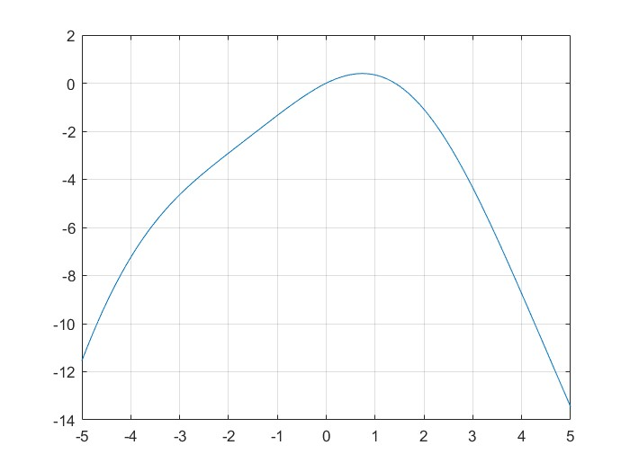
### fzero: 零点x=0的收敛域为 $[-5,0.73]$ ,迭代次数在7到12之间；零点x=1.404的收敛域为 $[0.73,14.79]$ ,迭代次数在4到13之间

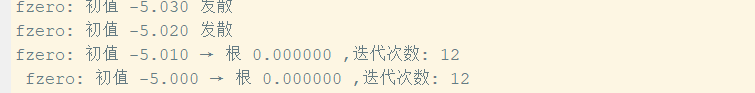
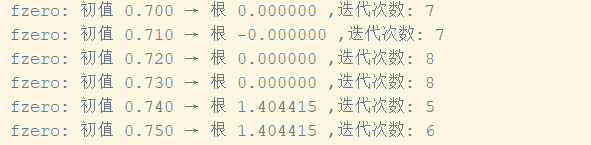
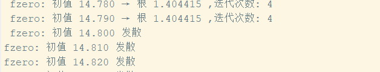

### fsolve: 零点x=0的收敛域为 $[-\infty ,0.73]$ ,迭代次数在4到任意大（取决于初值绝对值有多大）；零点x=1.404的收敛域为 $[0.73,+\infty)$ ,迭代次数可从6到任意大（取决于初值有多大）

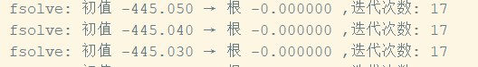
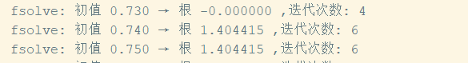
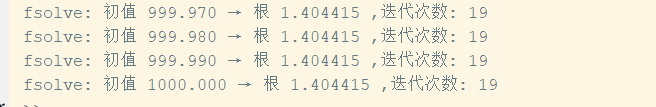

### fcustom: 不会收敛到零点x=0；零点x=1.404的收敛域为 $[-\infty,+\infty ]$ ,迭代次数可从12到任意大

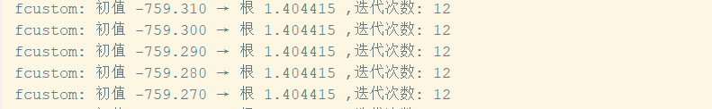
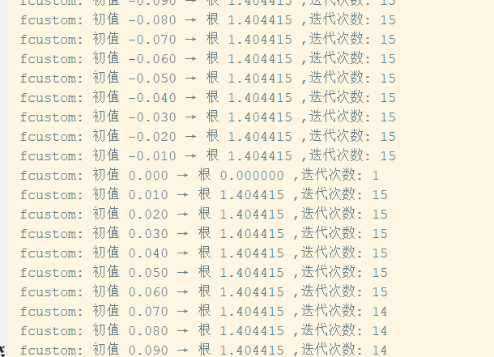
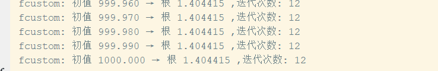

### newton: 零点x=0的收敛域为 $[-\infty,0.73]$ ,迭代次数可从10到任意大；零点x=1.404的收敛域为 $[0.73,+\infty ]$ ,迭代次数可从9到任意大

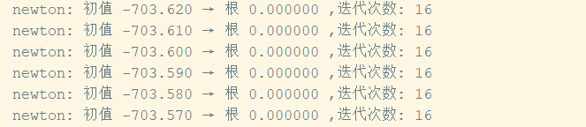

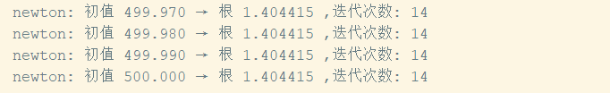
**主程序 code:**
```matlab
% 作图
x = -5:0.01:5;
f = @(x) sin(x) - x.^2 /2
ff = @(x) sqrt(2*sin(x));
df = @(x) cos(x) - x;
y = f(x);
plot(x,y),grid


% 求解
opt = optimset('TolX', 1e-8, 'Display', 'off');
x1 = -10:0.01:500;

% fzero
for x0 = x1
    [root1, fv1, ef1, out1] = fzero(f, x0, opt);
    if ef1> 0 % 收敛
        fprintf('fzero: 初值 %.3f → 根 %.6f ,迭代次数: %d\n ', x0, root1, out1.iterations);
    else
        fprintf('fzero: 初值 %.3f 发散\n', x0);
    end
end

% fsolve
for x0 = x1
    [root2, fv2, ef2, out2] = fsolve(f, x0, opt);
    if ef2> 0 % 收敛1
        fprintf('fsolve: 初值 %.3f → 根 %.6f ,迭代次数: %d\n ', x0, root2, out2.iterations);
    else
        fprintf('fsolve: 初值 %.3f 发散\n', x0);
    end
end

% fcustom
for x0 = x1
    [root2, ef2, iter] = fcustom(ff, x0);
    if ef2> 0 % 收敛1
        fprintf('fcustom: 初值 %.3f → 根 %.6f ,迭代次数: %d\n ', x0, root2, iter);
    else
        fprintf('fcustom: 初值 %.3f 发散\n', x0);
    end
end

% newton
for x0 = x1
    [root2, ef2, iter] = newton1(f, df, x0);
    if ef2> 0 % 收敛1
        fprintf('newton: 初值 %.3f → 根 %.6f ,迭代次数: %d\n ', x0, root2, iter);
    else
        fprintf('newton: 初值 %.3f 发散\n', x0);
    end
end

```


**迭代函数$=\sqrt{2sin(x)}$  函数 code:**
```matlab
function [root, ef, iterations] = fcustom(f, x0)                 
    tol = 1e-10;                     
    it_max = 100;                   
    x = zeros(1, it_max+1);         
    x(1) = x0;
    i = 1;
    dx = Inf;                     
    ef = -1;
    while (abs(dx) > tol*x(i))
        x(i+1) = f(x(i));    
        dx = x(i+1) - x(i);
        i = i + 1;
        if i < it_max
            ef = 1;
        else 
            error('Reached max iteration number');
            break;
    end
    root = x(i);
    iterations = i - 1;
end
```

**newton迭代函数 code:**
```matlab
function [root, ef, iterations] = newton1(f, df, x0)                 
    tol = 1e-10;                     
    it_max = 100;                   
    x = zeros(1, it_max+1);         
    x(1) = x0;
    i = 1;
    dx = Inf;                     
    ef = -1;
    while (abs(dx) > tol*x(i))
        x(i+1) = x(i) - f(x(i)) / df(x(i));    
        dx = x(i+1) - x(i);
        i = i + 1;
        if i < it_max
            ef = 1;
        else 
            error('Reached max iteration number');
            break;
    end
    root = x(i);
    iterations = i - 1;
end

```

## 6.5.3
### （1）模型建立：设：贷款本金为 **\( P \)** ，月利率为 **\( r \)**（年利率 \( R \) 除以 12，即 \( r = \frac{R}{12} \)），还款期数为 **\( n \)** 个月，每月还款额为 $M$ 

**第 1 个月**：
   - 月初欠款：\( P \)
   - 月末还款 \( M \) 后，剩余本金：
     \[
     P_1 = P(1 + r) - M
     \]

**第 2 个月**：
   - 月初欠款：\( P_1 \)
   - 月末还款 \( M \) 后，剩余本金：
     \[
     P_2 = P_1(1 + r) - M = [P(1 + r) - M](1 + r) - M = P(1 + r)^2 - M(1 + r) - M
     \]

**第 3 个月**：
   - 月初欠款：\( P_2 \)
   - 月末还款 \( M \) 后，剩余本金：
     \[
     P_3 = P_2(1 + r) - M = P(1 + r)^3 - M(1 + r)^2 - M(1 + r) - M \]

。。。。。。

**第 \( n \) 个月**：
     \[
     P_n = P(1 + r)^n - M \left[ (1 + r)^{n-1} + (1 + r)^{n-2} + \cdots + (1 + r) + 1 \right] \equiv 0 \\
     M [(1 + r)^n - 1]= P \cdot r \cdot (1 + r)^n
   \]

### 带入数据，先作图估计零点在 $2\times 10^{-3}$ 附近，然后用fzero解方程得月利率0.21%，年利率2.5%
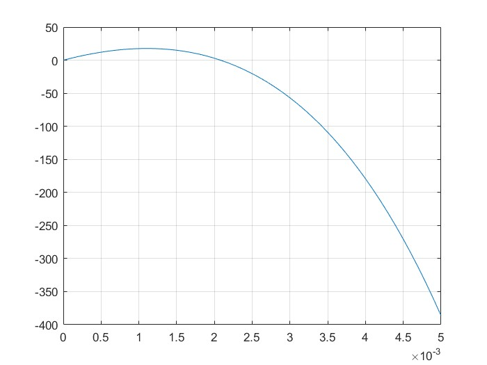
**code:**
```matlab
% 作图
P = 15e+4;
M =1e+3;
n = 15*12;

r = 0:0.0001:0.005;
f = @(r) M * ((1 + r) .^ n - 1) -P * r .* (1 + r) .^ n
y = f(r);
plot(r,y),grid


% 求解
opt = optimset('TolX', 1e-8, 'Display', 'off');
r0 = fzero(f, 8e-3, opt)
R0 = 12*r0

```
### （2）模型大致同（1）$n_1,n_2$ 以及 $M_1,M_2$稍有不同，详见代码。以年利率做比较，$R_1=0.0702,R_2=0.0639$，故而第二家较为优惠
**code:**
```matlab
% 作图
P = 50e+4;
M1 =4500;
n1 = 15*12;
M2 = 45000;
n2 = 20;
f = @(r,M,n) M * ((1 + r) .^ n - 1) -P * r .* (1 + r) .^ n

opt = optimset('TolX', 1e-8, 'Display', 'off');
r1 = fzero(f, 8e-3, opt,M1,n1)
R1 = 12*r1
R2 = fzero(f,12*4e-3,opt,M2,n2)

```
## 6.5.9
### 解方程，不动点为 $x^{*} = 0，x^{*} = ln(a)/b$ 。而不动点稳定的条件是 |f'(x*)| < 1。
\[ f'(x) = a(1 - bx)\exp(-bx) \]

### 对于x* = 0：
\[ f'(0) = a \]
### 当a < 1时稳定

### 对于x* = ln(a)/b：
\[ f'(x^*) = 1 - ln(a) \]
### 稳定条件：|1 - ln(a)| < 1 ⇒ 0 < ln(a) < 2 ⇒ 1 < a < e² ≈ 7.389
### 于是 $a=5$ 时收敛于不动点 $x* = ln(a)/b$  

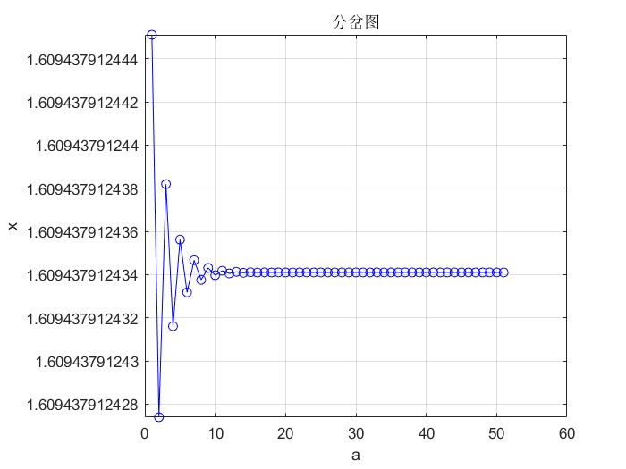
### $a=10时$ 周期2收敛
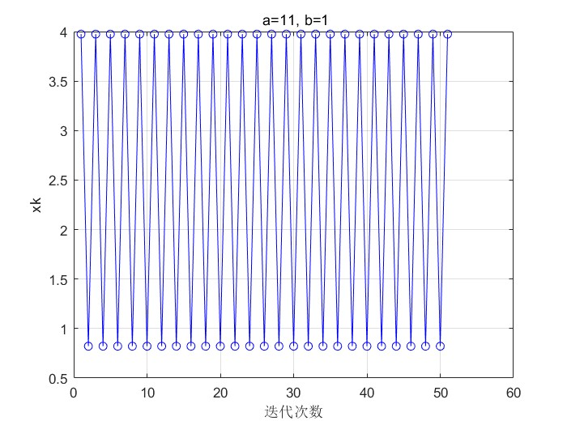
### $a=15$ 时有混沌现象
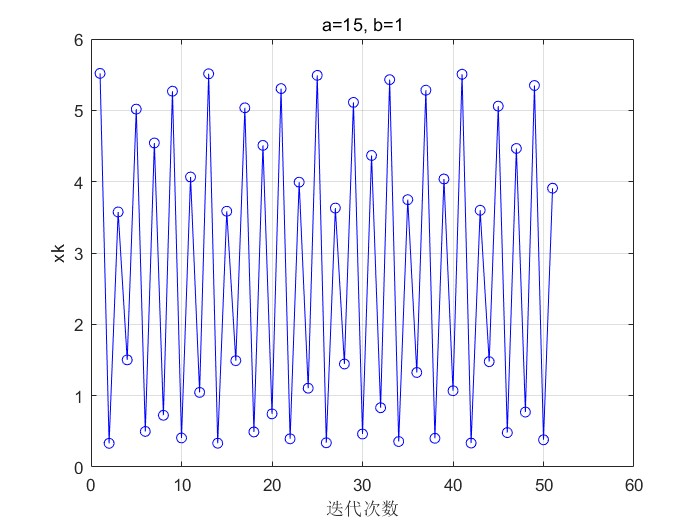
### 分岔图如下
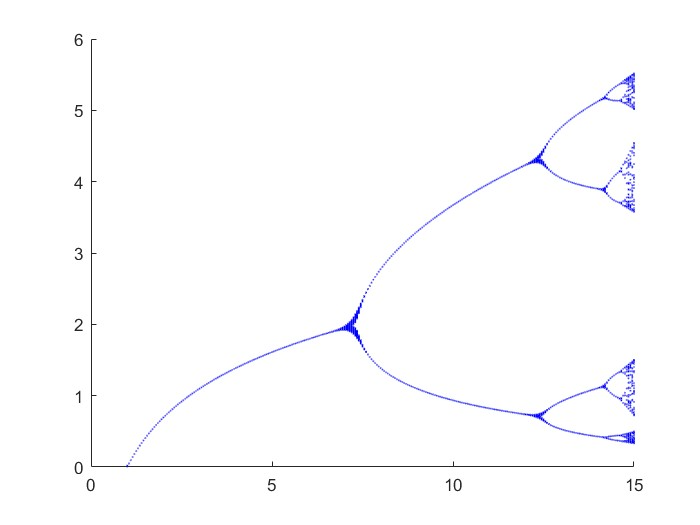